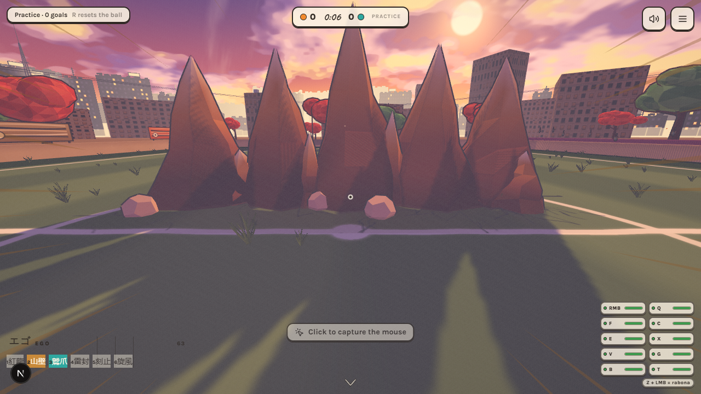
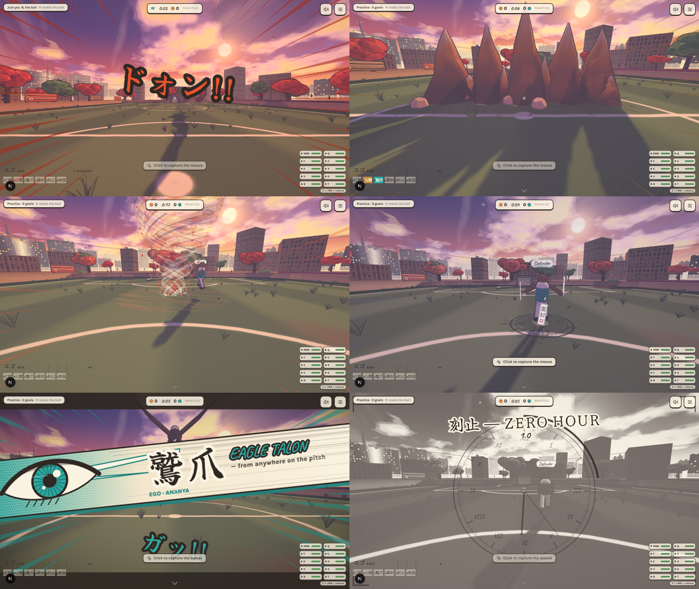
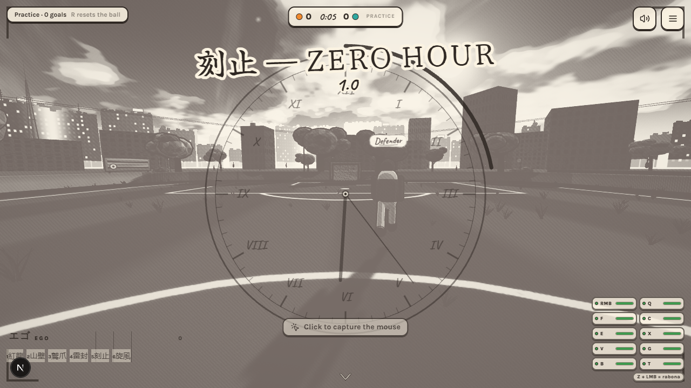

# Football BlueLock — Gulmohar Ground ⚽

**First-person gully football at golden hour.** Every friend is a footballer on the
pitch, seeing the match through their own eyes: dribble, sprint, use skill moves,
and kick the ball wherever you're looking — to pass, to cross, or to score.
2–10 players (4v4 is the sweet spot), two teams, on a hand-painted Indian maidan
rendered like an anime background painting — now with **Blue Lock–style EGO
super moves**.



---

## Quick start (local)

On Windows just double-click **`startup.bat`** — it installs dependencies on the
first run, frees port 3000 and opens the game in your browser. Or by hand:

```bash
bun install        # or npm install
bun run dev        # or npm run dev
```

Open **http://localhost:3000**.

- **Practice alone** works immediately and offline — with the AI defender, or
  in **Free play** with nobody else on the pitch —
  no configuration needed.
- **Multiplayer rooms** run through the bundled relay server (`startup.bat` starts it, or `npm run relay`).

## Multiplayer server

Rooms run on a tiny Node relay (`server/index.mjs`, WebSocket at `/ws`). It
owns the rooms (roster, host = oldest player, team balance, the 10-player cap,
dropping dead connections) and relays each client's messages to the rest of the
room. Game authority stays in the host's browser: ball, score, clock, rules.

- **Local:** `startup.bat` starts the relay on :3001 next to `next dev` on :3000.
- **Production:** the same process also serves the static build (`out/`) and
  answers `GET /health`.

Connections reconnect automatically; if the host leaves, the next-oldest player
takes over hosting and the match carries on. Background tabs keep simulating,
so alt-tabbing never freezes a match.

## EGO super moves



Play fills your **EGO gauge** (bottom-left): time on the ball, flair skills,
shots, clean tackles and goals. Spend it on keys **1–6** (or the chips on the
gauge on touch screens). In **Free play** supers cost nothing — a sandbox.

| Key | Super | EGO | What happens |
|---|---|---|---|
| **1** | 紅龍 **Crimson Dragon** | 100 | A serpent dragon coils round the ball and carries it wherever your crosshair points. Unblockable — anyone in its path is bowled over. |
| **2** | 山壁 **Mountain Bastion** | 50 | A ridge of rock peaks erupts where you look. Blocks the ball and players; anyone on the spot is launched. |
| **3** | 鷲爪 **Eagle Talon** | 60 | A spirit eagle swoops you onto the ball from anywhere; whoever had it is knocked flat. |
| **4** | 雷封 **Thunder Seal** | 70 | Storm sky; lightning roots every nearby rival in place, sealed by paper talismans. |
| **5** | 刻止 **Zero Hour** | 100 | Time stops for everyone else. A ball you kick hangs in the air until time resumes. |
| **6** | 旋風 **Gulmohar Cyclone** | 70 | A petal tornado drags rivals together and spins them. |

Every super fires a manga cut-in (the EGO eye flash), focus lines, brush-lettered
sound effects and an ink impact frame — all drawn as ink on paper to match the
painted look.



Online, a super is one broadcast event: every client plays the move and decides
for itself whether it was caught. The ball stays host-authoritative except
during the dragon's flight (a deterministic curve every client follows) and
Zero Hour (the caster owns the ball while time stands still).

## LAN play (same Wi-Fi — the smoothest way)

Playing in the same place? Host on one PC and nothing leaves your router:

1. On the host PC double-click **`lan.bat`** (first run installs + builds, ~1–2 min).
2. If Windows Firewall asks, click **Allow access** for *private* networks.
3. The window prints the address, e.g. `http://192.168.1.13:5757 (Wi-Fi)`.
   Everyone on the same Wi-Fi — laptops and phones — opens that address.
4. Create a room and share the code as usual. Keep the `lan.bat` window open.

The room screen shows a **LAN** badge when you're on a local server. After
pulling new code, run `lan.bat rebuild` once to rebuild the game.

## Hosting online

`render.yaml` is a [Render](https://render.com) blueprint for one Node web
service (Singapore region) that serves the game and runs the rooms:

1. Render → **New → Blueprint** → pick this repo → **Deploy**.
2. Free services sleep after 15 idle minutes, so point a
   [cron-job.org](https://console.cron-job.org) job at
   `https://<your-service>.onrender.com/health` every 10 minutes.

## Playing with friends

1. One player creates a room and shares the **4-character code**.
2. Everyone else joins with the code (2–10 players; the 11th is turned away).
3. The **first player in the room is HOST** — they can shuffle teams, move
   players between Saffron and Teal, and start the match.
4. Late joiners receive a full state snapshot and spectate until the next kickoff.
5. If the host leaves, the match ends gracefully, everyone returns to the lobby,
   and the next-oldest player becomes host.

**Match rules:** first to 5 goals, or the higher score after two 3-minute
halves. **Full football rules:** throw-ins (you hold the ball and fling it
with both hands), corners, goal kicks, direct free kicks, penalties, and
offside (flagged when a flagged receiver touches the ball — offside is off in
practice). Slide tackles are the foul mechanic: catch the ball first or the
whistle goes — a foul in the box is a penalty. No goalkeepers (street rules:
defend with your feet). The host can trigger a rematch from the victory screen.

## Controls

### Desktop

| Input | Action |
|---|---|
| **WASD / arrows** | Move (relative to look direction) |
| **Mouse** (pointer lock) | Look — **this is your aim** |
| **Shift** (hold) | Sprint (watch the stamina bar, bottom-left) |
| **LMB** (hold & release) | Charge and kick — power = hold time (1 s = full) |
| Look **down** while kicking | Driven pass / shot |
| Look **up** while kicking | Chip / lob over opponents (dashed arc shows the landing) |
| **RMB** | Quick sidestep cut (works from a standstill, stronger with speed) |
| **Q** | Stepover feint — shoulder sway, then burst |
| **F** | Flick the ball up and over a tackle |
| **C / Ctrl** | Slide tackle — a committed lunge. Win the ball = clean poke; catch an opponent first = **foul** (free kick, or a **penalty** in the box) |
| **E** | **Rainbow** — the ball rolls up your standing leg and heel-flicks over your head (3 s cooldown) |
| **Z** (while holding LMB) | **Rabona** — releases the charged kick cross-legged: ×1.08 power, extra loft, planted-hop animation |
| **X** | **Roulette / Marseille turn** — full 360° spin, ball under your sole, exits forward at speed (4 s cooldown) |
| **V** | **Elastico** — push the ball out one way, snap it hard across the other (side follows your strafe key) |
| **G** | **Cruyff turn** — fake-shot windup, drag the ball behind your standing leg, turn 180° |
| **B** | **Backheel** — clip the ball opposite your facing with a little hop |
| **T** | **Juggle** on/off — rhythmic keepy-uppy (walk speed only). Kick mid-bounce for a **volley**; sprint or T again to drop it |
| *(automatic)* | Any kick with the ball above knee height plays a **scissor volley** instead of the ground swing |
| **R** (solo modes) | Reset the ball to your feet |
| **Esc / P** | Release the mouse / open the menu (with settings) |

### Touch (phones & tablets — controls appear automatically)

- **Left thumb:** virtual joystick to move.
- **Right side:** drag anywhere to look.
- **KICK button** (the big one): hold to charge, release to strike (also takes
  throw-ins).
- **RUN / STEP / TRICKS / CUT / FLICK / SLIDE** buttons for the rest — TRICKS
  opens a tray with **Rainbow, Rabona (works with a held KICK charge), Spin,
  Elastico, Cruyff, Heel and Juggle**.

## Settings

In the main menu and the pause menu (**Settings**):

- **Field of view** — 60° to 100° (default 78°).
- **Mouse sensitivity** — 0.25× to 3× (applies to touch look too).
- **Invert look (Y axis)**.
- **Volume**.
- **Graphics quality** — Low / Medium / High, applied **live**: ink outline
  width, shadow resolution, MSAA, pixel ratio, prop density (skyline, wires,
  hoardings, second tree row), grass tufts and crowd counts. Low is the
  default on touch devices; your choice is remembered.

Everything persists in `localStorage` — no account, no server.

## Solo modes

**Practice** — free solo play with an AI defender that drops off goal-side,
hunts loose balls in its zone, and clears its lines. All the match rules
apply (offside is off) — including throw-ins and penalties against you if you
slide late. Score, celebrate under the petal confetti, and the ball comes
back to your feet. Press **R** any time.

**Free play** — the whole ground to yourself: no AI, no opponents, no
whistles. The compound wall keeps every ball in play, goals still count (and
still celebrate), and the session timer runs as long as you like. Press **R**
to call the ball back to your feet.


## Architecture

```
src/game/
├── core/        constants, shared types, math, procedural WebAudio engine
├── net/         WebSocket relay client (rooms, roster, reconnects)
├── sim/         input (kb/mouse/touch), local player, ball physics,
│                remote-player interpolation buffers
├── render/      toon BRDF patch, outlines, post grade, world, players,
│                ball, view-model legs, particles, camera rig
├── ui/          React overlays (menu, lobby, HUD, touch controls)
└── Game.ts      orchestrator: state machine + fixed-timestep loop
```

### Netcode model

- Every client is authoritative over **its own transform**, broadcasting at
  **20 Hz**; others interpolate through a **120 ms** buffer.
- The **HOST is the sole arbiter of ball state**: physics, player-ball
  collisions, kick impulses, goals, score, clock, and phases, broadcast at
  **15 Hz**.
- **Local ball prediction:** while the ball is within dribble range of *your*
  player, your client simulates it locally so it sits convincingly at your feet
  even with latency; corrections from the host blend in gently (~200 ms) while
  dribbling and snap cleanly otherwise.
- **Kicks** are requests: the client plays the swing, thump, and grass
  immediately (cosmetic), and the host applies the impulse only after
  validating range and power cap — absurd or out-of-range kicks are silently
  rejected.
- Player-player collisions are a soft local push from the latest known
  positions (unsynced).

### The painted look

- `MeshToonMaterial` with a hand-authored 4-band gradient ramp; the toon BRDF
  (`lights_toon_pars_fragment`) is patched so **darker bands are hue-shifted
  toward violet** — coloured shadows, the heart of cel painting.
- **Inverted-hull outlines** (back-faced shells pushed along smoothed normals,
  constant pixel width) on the ball, goalposts, players, legs, and trees.
- Two-light anime setup: warm golden key (the only shadow caster, sinking as
  the match runs so shadows stretch), strong cool bounce from the opposite
  quarter, weak up-light, violet-grounded hemisphere.
- Gulmohar canopies are **faceted painterly clumps** — every icosahedron face
  carries its own tone from a small blossom palette (vertex colours), and they
  cast **dappled** light via an alpha-tested custom depth material.
- A painted dusk sky (2048px): banded gradient, wide sun glow + halo rings,
  cream-topped cumulus with dusty-rose undersides, cirrus streaks, and two
  layered hill ridges dissolving into the horizon haze.
- The skyline: 20+ city blocks with lit windows, a stepped temple gopuram, a
  radio mast, power poles with sagging wires, painted hoardings, and stepped
  crowd stands on three sides.
- Final grade: split-tone (violet darks / warm paper highlights), lifted
  blacks, paper grain, sRGB. No bloom, no glow — it's a painting.

### Performance

- Fixed-timestep simulation (60 Hz) with a frame-rate-independent renderer —
  the match runs at true speed even on struggling GPUs.
- Graphics presets (Low / Medium / High) switch **at runtime** from the
  settings panel: outline width, shadow map size, MSAA samples, pixel ratio,
  prop density, tuft/crowd counts. Touch devices default to Low.

## Troubleshooting

- **Can't create a room locally** — the relay isn't running; start the game
  with `startup.bat` (or run `npm run relay` beside `npm run dev`).
- **Room stays empty when friends join** — double-check the 4-character code.
- **Can't move after kickoff** — click the pitch once to capture the mouse;
  press Esc to release it.
- **Supers don't fire** — check the EGO gauge; each move shows how much it
  needs. Crimson Dragon needs the ball at your feet.

---

*Grass kick-ups, marigold petal confetti, distant crows, a faraway temple bell.
Golden hour never ends.* 🌇
